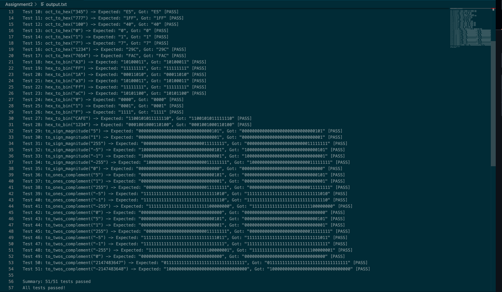

# CS 3503 Assignment 2 - Data Representation Mapping


# Author
Douglas Tanyanyiwa


# Description 
This program converts number between different formats (octal, binary and hexadecimal) and shows how computers represent negative numbers. It's part of learning how computers store and work with numbers.

## Build Instructions
1. Compile main.c and convert.c int an executable file named convert
```sh
gcc -o convert convert.c main.c 
```
2. Run the program
```
./convert
```
3. Look at the results
```
cat output.txt
```

## Test Results
Summary: 51/51 tests passed




## How It Works
### Converting Between Number Systems
### The program uses lookup tables to convert between different number systems:

•Each octal digit becomes exactly 3 binary digits
•Each hex digit becomes exactly 4 binary digits
•For octal to hex, we go through binary as an intermediate step

### Representing Negative Numbers
The program shows 3 different ways computers can store negative numbers:

•Sign-Magnitude: Use first bit for + or -, rest for the number size
•One's Complement: Flip all the bits to make a number negative
•Two's Complement: Flip all bits and add 1 (this is what modern computers use)


## Notes

The program handles both uppercase and lowercase hex letters
It removes leading zeros from results when appropriate
All signed numbers use 32 bits (like a normal int)
The test file has over 60 test cases to make sure everything works

### What I Learned

How different number systems relate to each other
Why computers use binary internally
How negative numbers are stored in computer memory
How to read files and parse data in C
How to write and test C functions

